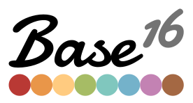

# 
Not a theme, but a framework for building [Tomorrow](https://github.com/chriskempson/tomorrow-theme) styled themes using a base of sixteen colours. Since _August 2012_, Base16 has provided a minimal set of guidelines that explain how to [style syntax](https://github.com/chriskempson/base16/blob/main/styling.md) and [how to build](https://github.com/chriskempson/base16/blob/main/builder.md) Base16 [_schemes_ and _templates_](https://github.com/chriskempson/base16/blob/main/file.md).

## Limitations
Base16 was designed with the following limitations to ensure the project remains simple and keeps a small scope:
* A 16 colour palette of 8 shades and 8 accents
* All themes produced are the same apart from variations in colour
* You can't change the colour of one element without affecting another
* Builders are very simple and have one job

## Resources
* [Theme Templates](https://github.com/chriskempson/base16-templates-source) (plus pre-compiled themes)
* [Colour Schemes](https://github.com/chriskempson/base16-schemes-source)
* [Builders](https://github.com/chriskempson/base16-builder-php)

## Third-party Tools
* [auto-base16-theme](https://github.com/makuto/auto-base16-theme) - A command line tool to create a base16 theme from an input image's colour palette.
* [base16-manager](https://github.com/AuditeMarlow/base16-manager) - A command line tool to install base16 templates and set themes globally.
* [base16-shell-preview](https://github.com/nvllsvm/base16-shell-preview) - A command line tool to preview and set base16-shell themes.
* [base16-universal-manager](https://github.com/binaryplease/base16-universal-manager) - A command line tool to automatically get, build and set base16 themes globally for *all* supported applications. Themes and templates are pulled form the official repositories or from a local cache.
* [flavours](https://github.com/misterio77/flavours) - A command line tool to manage and globally apply base16 templates by specifying a scheme name.
* [Themix/Oomox](https://github.com/themix-project/oomox) - Graphical application for generating different colour variations of a Arc, Materia and Oomox themes (GTK2, GTK3 and others), Archdroid, Gnome-Colours and Numix icons, and terminal palette. Base16 plugin allows to open Base16 YAML files a export both Base16 and its own themes using Base16 Mustache templates.
* [base16-spectrum-generator](https://github.com/alexmirrington/base16-spectrum-generator) - A Python script for generating `.png` files showcasing the colours in a base16 theme.

## Used By
* [Visual Studio Code](https://code.visualstudio.com) - Tommorrow Night Blue theme included by default.
* [Atom Editor](https://atom.io) - [One Theme](https://github.com/atom/atom/tree/master/packages/one-dark-syntax) & [Tomorrow](https://github.com/atom/atom/tree/master/packages/base16-tomorrow-dark-theme) theme included by default.
* [c-Tiles16](https://github.com/atelierbram/c-tiles16) - Colourscheming with Variables.
* [Spacegray](https://github.com/kkga/spacegray) - A set of custom UI themes for Sublime Text 2/3.
* [Harmonic16](http://janniks.github.io/harmonic16) - A colour generator for harmonic Base16 colour schemes.
* [Duotone-base16](https://github.com/davidosomething/duotone-base16) - A Duotone scheme to Base16 convertor.
* [terminal.sexy](https://terminal.sexy) - Terminal Colour Scheme Designer
* [Just-Colors](https://github.com/andreyvpng/just-colors) - Simple configuration file generator
* [Highlight.js](https://highlightjs.org) - JavaScript syntax highlighter
