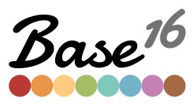

# 

An architecture for building themes based on  carefully chosen syntax highlighting using a base of sixteen colours. Base16 provides a set of guidelines detailing how to style syntax and how to code a _builder_ for compiling base16 _schemes_ and _templates_.

## Documentation
* [Styling Guidelines](https://github.com/chriskempson/base16/blob/master/styling.md)
* [Builder Guidelines](https://github.com/chriskempson/base16/blob/master/builder.md)
* [File Guidelines](https://github.com/chriskempson/base16/blob/master/file.md)

## Template Repositories

To add your own template, submit a pull request to https://github.com/chriskempson/base16-templates-source and add your repository to the list below. **Repository naming scheme: base16-[template-name]** (with dashes as separators).

* [Alacritty](https://github.com/aaron-williamson/base16-alacritty) maintained by [aaron-williamson](https://github.com/aaron-williamson)
* [Blink](https://github.com/niklaas/base16-blink) maintained by [niklaas](https://github.com/niklaas)
* [BBEdit](https://github.com/hrbn/base16-bbedit) maintained by [hrbn](https://github.com/hrbn)
* [C Header](https://github.com/m1sports20/base16-c_header) maintained by [m1sports20](https://github.com/m1sports20)
* [ConEmu](https://github.com/martinlindhe/base16-conemu) maintained by [martinlindhe](https://github.com/martinlindhe)
* [Crosh](https://github.com/philj56/base16-crosh) maintained by [philj56](https://github.com/philj56)
* [Dunst](https://github.com/khamer/base16-dunst) maintained by [khamer](https://github.com/khamer)
* [Emacs](https://github.com/belak/base16-emacs) maintained by [belak](https://github.com/belak)
* [fzf](https://github.com/nicodebo/base16-fzf) maintained by [nicodebo](https://github.com/nicodebo)
* [Gnome Terminal](https://github.com/aaron-williamson/base16-gnome-terminal) maintained by [aaron-williamson](https://github.com/aaron-williamson)
* [GTK+2](https://github.com/dawikur/base16-gtk2) maintained by [dawikur](https://github.com/dawikur)
* [Highlight](https://github.com/bezhermoso/base16-highlight) maintained by [bezhermoso](https://github.com/bezhermoso)
* [HTML Previews](https://github.com/chriskempson/base16-html-preview) maintained by [chriskempson](https://github.com/chriskempson)
* [i3](https://github.com/khamer/base16-i3) maintained by [khamer](https://github.com/khamer)
* [iTerm2](https://github.com/martinlindhe/base16-iterm2) maintained by [martinlindhe](https://github.com/martinlindhe)
* [Jetbrains](https://github.com/adilosa/base16-jetbrains) maintained by [adilosa](https://github.com/adilosa)
* [JOE](https://github.com/jjjordan/base16-joe) maintained by [jjjordan](https://github.com/jjjordan)
* [Kakoune](https://github.com/leira/base16-kakoune) maintained by [leira](https://github.com/leira)
* [Konsole](https://github.com/cskeeters/base16-konsole) maintained by [cskeeters](https://github.com/cskeeters)
* [MinTTY](https://github.com/geoffstokes/base16-mintty) maintained by [geoffstokes](https://github.com/geoffstokes)
* [MonoDevelop](https://github.com/netpyoung/base16-monodevelop) maintained by [netpyoung](https://github.com/netpyoung)
* [Prism](https://github.com/atelierbram/base16-prism) maintained by [atelierbram](https://github.com/atelierbram)
* [prompt-toolkit & ipython](https://github.com/memeplex/base16-prompt-toolkit) maintained by [memeplex](https://github.com/memeplex)
* [PuTTY](https://github.com/benjojo/base-16-putty) maintained by [benjojo](https://github.com/benjojo)
* [Pygments](https://github.com/mohd-akram/base16-pygments) maintained by [mohd-akram](https://github.com/mohd-akram)
* [Qt Creator](https://github.com/ilpianista/base16-qtcreator) maintained by [ilpianista](https://github.com/ilpianista)
* [Rofi](https://github.com/0xdec/base16-rofi) maintained by [0xdec](https://github.com/0xdec)
* [Shell](https://github.com/chriskempson/base16-shell) maintained by [chriskempson](https://github.com/chriskempson)
* [Scide](https://github.com/brunoro/base16-scide) maintained by [brunoro](https://github.com/brunoro)
* [Snazzy](https://github.com/gretzky/snazzy) maintained by [gretzky](https://github.com/gretzky)
* [st](https://github.com/honza/base16-st) maintained by [honza](https://github.com/honza)
* [StumpWM](https://github.com/tpine/base16-stumpwm) maintained by [tpine](https://github.com/tpine)
* [CSS, Less, Sass/Scss & Stylus](https://github.com/samme/base16-styles) maintained by [samme](https://github.com/samme)
* [Termite](https://github.com/khamer/base16-termite) maintained by [khamer](https://github.com/khamer)
* [TextMate & Sublime Text](https://github.com/chriskempson/base16-textmate) maintained by [chriskempson](https://github.com/chriskempson)
* [Tilix](https://github.com/karlding/base16-tilix) maintained by [karlding](https://github.com/karlding)
* [Vim](https://github.com/chriskempson/base16-vim) maintained by [chriskempson](https://github.com/chriskempson)
* [Vis](https://github.com/pshevtsov/base16-vis) maintained by [pshevtsov](https://github.com/pshevtsov)
* [VSCode](https://github.com/golf1052/base16-vscode) maintained by [golf1052](https://github.com/golf1052)
* [Windows Command Prompt](https://github.com/iamthad/base16-windows-command-prompt) maintained by [iamthad](https://github.com/iamthad)
* [Xcode](https://github.com/kreeger/base16-xcode) maintained by [kreeger](https://github.com/kreeger)
* [XFCE4 Terminal](https://github.com/afg984/base16-xfce4-terminal) maintained by [afg984](https://github.com/afg984)
* [Xresources](https://github.com/chriskempson/base16-xresources) maintained by [chriskempson](https://github.com/chriskempson)
* [zathura](https://github.com/nicodebo/base16-zathura) maintained by [nicodebo](https://github.com/nicodebo)

## Scheme Repositories

To add your own scheme, submit a pull request to https://github.com/chriskempson/base16-schemes-source and add your repository to the list below. **Repository naming scheme: base16-[scheme-name]-scheme** (with dashes as separators).

* [Atelier](https://github.com/atelierbram/base16-atelier-schemes) maintained by [atelierbram](https://github.com/atelierbram)
* [Brush Trees](https://github.com/whiteabelincoln/base16-brushtrees-scheme) maintained by [whiteabelincoln](https://github.com/whiteabelincoln)
* [Circus](https://github.com/stepchowfun/base16-circus-scheme) maintained by [stepchowfun](https://github.com/stepchowfun) and [ewang12](https://github.com/ewang12)
* [Classic](https://github.com/detly/base16-classic-scheme) maintained by [detly](https://github.com/detly)
* [Codeschool](https://github.com/blockloop/base16-codeschool-scheme) maintained by [blockloop](https://github.com/blockloop)
* [Cupertino](https://github.com/Defman21/base16-cupertino) maintained by [Defman21](https://github.com/Defman21)
* [Default](https://github.com/chriskempson/base16-default-scheme) maintained by [chriskempson](https://github.com/chriskempson)
* [Dracula](https://github.com/dracula/base16-dracula-scheme) maintained by [mikebarkmin](https://github.com/mikebarkmin)
* [Github](https://github.com/Defman21/base16-github-scheme) maintained by [Defman21](https://github.com/Defman21)
* [Gruvbox](https://github.com/dawikur/base16-gruvbox-scheme) maintained by [dawikur](https://github.com/dawikur)
* [Icy](https://github.com/icyphox/base16-icy-scheme) maintained by [icyphox](https://github.com/icyphox)
* [Materia](https://github.com/Defman21/base16-materia) maintained by [Defman21](https://github.com/Defman21)
* [Material Theme](https://github.com/ntpeters/base16-materialtheme-scheme) maintained by [ntpeters](https://github.com/ntpeters)
* [Mellow](https://github.com/gidsi/base16-mellow-scheme) maintained by [gidsi](https://github.com/gidsi)
* [Mexico-Light](https://github.com/drzel/base16-mexico-light-scheme) maintained by [drzel](https://github.com/drzel)
* [Nord](https://github.com/8-uh/base16-nord-scheme) maintained by [8-uh](https://github.com/8-uh)
* [One Light](https://github.com/purpleKarrot/base16-one-light-scheme) maintained by [purpleKarrot](https://github.com/purpleKarrot)
* [Onedark](https://github.com/tilal6991/base16-onedark-scheme) maintained by [tilal6991](https://github.com/tilal6991)
* [Porple](https://github.com/AuditeMarlow/base16-porple-scheme) maintained by [AuditeMarlow](https://github.com/AuditeMarlow)
* [Rebecca](https://github.com/vic/base16-rebecca) maintained by [vic](https://github.com/vic)
* [Summerfruit](https://github.com/cscorley/base16-summerfruit-scheme) maintained by [cscorley](https://github.com/cscorley)
* [Tomorrow](https://github.com/chriskempson/base16-tomorrow-scheme) maintained by [chriskempson](https://github.com/chriskempson)
* [Twilight](https://github.com/hartbit/base16-twilight-scheme) maintained by [hartbit](https://github.com/hartbit)
* [Unikitty](https://github.com/joshwlewis/base16-unikitty) maintained by [joshwlewis](https://github.com/joshwlewis)
* [Woodland](https://github.com/jcornwall/base16-woodland-scheme) maintained by [jcornwall](https://github.com/jcornwall)
* [Zenburn](https://github.com/elnawe/base16-zenburn-scheme) maintained by [elnawe](https://github.com/elnawe)
* [XCode Dust](https://github.com/gonsie/base16-xcode-dusk-scheme) maintained by [gonsie](https://github.com/gonsie)
* [Old Unclaimed Schemes](https://github.com/chriskempson/base16-unclaimed-schemes) - If your scheme is in this repository, please give it a new home!

## Builder Repositories

**Repository naming scheme: base16-builder-[language]** (with dashes as separators). The separate headings are the latest versions of the spec supported by each builder.

### 0.9.0
* [Base 16 Builder Clojure](https://github.com/nhurden/base16-builder-clojure) maintained by [nhurden](https://github.com/nhurden)
* [Base 16 Builder Elixir](https://github.com/obahareth/base16-builder-elixir) maintained by [obahareth](https://github.com/obahareth)
* [Base 16 Builder Go](https://github.com/belak/base16-builder-go) maintained by [belak](https://github.com/belak)
* [Base 16 Builder PHP](https://github.com/chriskempson/base16-builder-php) maintained by [chriskempson](https://github.com/chriskempson)
* [Base 16 Builder Python](https://github.com/InspectorMustache/base16-builder-python) maintained by [InspectorMustache](https://github.com/InspectorMustache)
* [Base 16 Builder Ruby](https://github.com/obahareth/base16-builder-ruby) maintained by [obahareth](https://github.com/obahareth)
* [Base 16 Builder Rust](https://github.com/ilpianista/base16-builder-rust) maintained by [ilpianista](https://github.com/ilpianista)
* [Base 16 Builder Typescript](https://github.com/golf1052/base16-builder-typescript) maintained by [golf1052](https://github.com/golf1052)

### 0.8.1

* [Base 16 Builder Perl](https://github.com/loomer/base16-builder-perl) maintained by [loomer](https://github.com/loomer)

### 0.8.0

* [Base 16 Builder Node.js](https://github.com/richardneililagan/base16-builder-node) maintained by [richardneililagan](https://github.com/richardneililagan)

## Scheme and Template Author Resources

The following is a list of useful resources for anyone creating a base16 scheme and or template:

* [Code Examples](https://github.com/chriskempson/base16-code-examples) - A list of example code file for various languages.
* [TmTheme Editor](http://tmtheme-editor.herokuapp.com) - An online editor for themes in tmTheme format.
* [Base16 Template Converter](https://github.com/ntpeters/base16-template-converter) - A script to automatically convert Base16 templates written in the old Embedded Ruby style to the new Mustache style.

## Tools for using Base16

* [base16-manager](https://github.com/AuditeMarlow/base16-manager) - A command line tool to install base16 templates and set themes globally.

## Projects using Base16

* [Atom Editor](https://atom.io/) Atom.io
* [c-Tiles16](https://github.com/atelierbram/c-tiles16) - Colorscheming with Variables.
* [Spacegray](https://github.com/kkga/spacegray) - A set of custom UI themes for Sublime Text 2/3.
* [Harmonic16](http://janniks.github.io/harmonic16) - A color generator for harmonic base16 color-schemes.
* [Duotone-base16](https://github.com/davidosomething/duotone-base16/) - A Duotone scheme to Base16 convertor.
* [terminal.sexy](https://terminal.sexy/) - Terminal Color Scheme Designer
